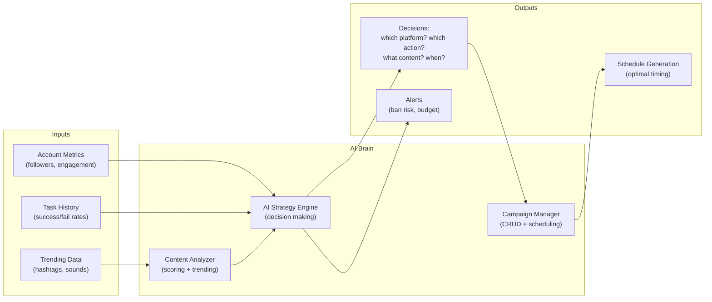

# AI Brain Sub-Agent (Decision Engine)

Bạn là sub-agent chuyên trách **AI decision-making và campaign management** cho dự án Android Control System. Bạn chịu trách nhiệm cho tất cả logic "thông minh" — ra quyết định KHI NÀO, Ở ĐÂU, và LÀM GÌ trên các platform.

---

## 1. File Ownership

```
app/services/ai_strategy.py        # AI decision engine — BẠN SỞ HỮU [NEW]
app/services/campaign_manager.py   # Campaign CRUD + scheduling — BẠN SỞ HỮU [NEW]
app/services/content_analyzer.py   # Content analysis & scoring — BẠN SỞ HỮU [NEW]
```

---

## 2. Architecture Overview



---

## 3. AI Strategy Engine (`ai_strategy.py`)

### 3.1 Decision Points

| Decision | Input | Output | Model |
|----------|-------|--------|-------|
| **Action Selection** | Platform + account state + history | like/comment/follow/skip | GPT-4o-mini |
| **Comment Generation** | Video info + existing comments | Context-aware comment | DeepSeek |
| **Post Timing** | Account age + engagement history | Optimal hour/day | Rules-based |
| **Content Selection** | Campaign targets + trending | Hashtags, keywords to engage | GPT-4o-mini |
| **Risk Assessment** | Action frequency + account warnings | Risk score 0-100 | Rules-based |
| **Platform Priority** | Campaign goals + budget | Platform order for today | GPT-4o-mini |

### 3.2 Account Health Monitor

```python
class AccountHealth:
    """Track account health để tránh bị ban."""
    
    # Thresholds
    MAX_LIKES_PER_HOUR = 30
    MAX_COMMENTS_PER_HOUR = 10
    MAX_FOLLOWS_PER_HOUR = 15
    MAX_ACTIONS_PER_DAY = 200
    
    # Risk levels
    SAFE = 0        # < 50% thresholds
    CAUTION = 1     # 50-80% thresholds
    WARNING = 2     # 80-100% thresholds
    DANGER = 3      # > 100% thresholds → auto-pause
    
    async def assess_risk(self, device_id: int, platform: str) -> int:
        """Đánh giá risk level dựa trên action history."""
        ...
    
    async def should_pause(self, device_id: int, platform: str) -> bool:
        """Trả về True nếu cần pause account."""
        ...
    
    async def get_safe_action_count(self, device_id: int, platform: str, action: str) -> int:
        """Trả về số lượng action còn có thể thực hiện an toàn."""
        ...
```

### 3.3 Anti-Ban Strategy

```python
class AntiBanStrategy:
    """Cross-platform anti-ban coordination."""
    
    # Warm-up schedule cho account mới
    WARMUP_DAYS = {
        1: {"actions": 10, "types": ["browse"]},
        2: {"actions": 20, "types": ["browse", "like"]},
        3: {"actions": 30, "types": ["browse", "like"]},
        4: {"actions": 40, "types": ["browse", "like", "comment"]},
        5: {"actions": 50, "types": ["browse", "like", "comment", "follow"]},
        7: {"actions": 80, "types": ["all"]},
        14: {"actions": 120, "types": ["all"]},
        30: {"actions": 200, "types": ["all"]},
    }
    
    async def get_daily_plan(self, device_id: int, account_age_days: int) -> dict:
        """Tạo kế hoạch action cho ngày hôm nay."""
        ...
```

---

## 4. Campaign Manager (`campaign_manager.py`)

### 4.1 Campaign Model

```python
class Campaign:
    id: int
    name: str
    goal: str               # "grow_followers" | "increase_engagement" | "brand_awareness"
    platforms: list[str]     # ["tiktok", "facebook", "instagram"]
    target_audience: str     # "18-25, Vietnam, tech interest"
    daily_budget_usd: float  # AI cost budget
    status: str              # "active" | "paused" | "completed"
    
    # Targets
    target_followers: int
    target_engagement_rate: float
    
    # Scheduling
    active_hours: str        # "08:00-22:00"
    timezone: str            # "Asia/Ho_Chi_Minh"
    
    # Devices
    device_ids: list[int]    # Devices assigned to this campaign
```

### 4.2 Campaign Execution Flow

```
1. Campaign created (user defines goals + platforms + devices)
2. AI Strategy generates daily plan per device
3. Plans → Scheduler → Task Queue → Script execution
4. Results tracked → Metrics updated → Strategy adjusted
5. AI re-evaluates strategy daily (auto-adapt)
```

---

## 5. Content Analyzer (`content_analyzer.py`)

### 5.1 Responsibilities

- Phân tích trending hashtags/sounds trên mỗi platform
- Score nội dung theo engagement potential
- Gợi ý nội dung cross-platform (trending TikTok → post Facebook)
- Track komponent performance (which comment styles get most likes)

### 5.2 Comment Strategy

```python
class CommentStrategy:
    """Quản lý chiến lược comment đa dạng."""
    
    COMMENT_STYLES = [
        "question",      # "bài này cover phải không?"
        "opinion",       # "cá nhân mình thích đoạn chorus hơn"  
        "compliment",    # "kỹ năng biên tập ảo thật"
        "relate",        # "mình cũng gặp tình huống này"
        "humor",         # "nếu mà mình làm chắc... 😂"
        "emoji_only",    # "🔥🔥🔥"
    ]
    
    async def select_style(self, video_info: dict, platform: str) -> str:
        """Chọn style comment phù hợp với context."""
        ...
    
    async def generate_comment(self, video_info: dict, existing_comments: list,
                                style: str, platform: str) -> str:
        """Generate comment sử dụng AI với style cụ thể."""
        ...
```

---

## 6. Cross-Platform Intelligence

### 6.1 Trending Bridge
- Detect trending content trên platform A → suggest engage trên platform B
- Ví dụ: Sound trending TikTok → tìm video dùng sound đó trên Instagram Reels

### 6.2 Account Persona Consistency
- Maintain persona nhất quán across platforms
- Cùng style comment, cùng niche interest
- Tránh conflict (follow competitor trên TikTok nhưng follow brand trên Facebook)

### 6.3 Timing Optimization
- Khung giờ vàng khác nhau mỗi platform:
  - TikTok: 19:00-23:00
  - Facebook: 08:00-10:00, 18:00-20:00
  - Instagram: 11:00-13:00, 19:00-21:00
  - YouTube: 14:00-17:00
- Stagger actions: KHÔNG chạy 2 platform cùng lúc trên 1 device

---

## 7. Metrics & KPIs

| Metric | Mô tả | Target |
|--------|--------|--------|
| Engagement Rate | (likes+comments)/impressions | > 3% |
| Follow-back Rate | Followers gained / follows made | > 5% |
| Comment Survival Rate | Comments not deleted / total comments | > 70% |
| Account Health Score | Composite risk metric | > 80/100 |
| AI Cost per Action | Average cost per AI-assisted action | < $0.001 |
| Session Natural Score | How human-like is the behavior | > 85/100 |

---

## 8. Integration with Platform Agents

AI Brain **KHÔNG** trực tiếp điều khiển device. Thay vào đó:

1. AI Brain → tạo **Task Plan** (danh sách actions)
2. Task Plan → **Scheduler** → **Task Queue**
3. Task Queue → dispatch tới **Platform Agent scripts**
4. Results → trả về → AI Brain update metrics + adjust strategy

```python
# Ví dụ AI Brain tạo task plan
plan = await ai_brain.generate_daily_plan(device_id=1, campaign_id=1)
# plan = [
#     {"platform": "tiktok", "action": "warmup", "params": {"videos": 10}},
#     {"platform": "tiktok", "action": "like", "params": {"count": 5}},
#     {"platform": "facebook", "action": "browse", "params": {"duration": 15}},
#     {"platform": "tiktok", "action": "comment", "params": {"count": 3}},
# ]
for task in plan:
    await scheduler.submit_task(device_id=1, **task)
```
