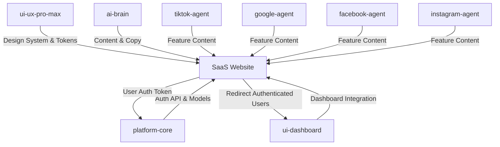

# SaaS Website Plan — Android Control Platform

## Vision

Build a public-facing SaaS marketing website to sell the Android Control automation platform as a service. The website will serve as the **gateway** for potential customers to understand, try, and subscribe to the platform.

> [!IMPORTANT]
> This is a **separate website** from the internal admin dashboard (`app/static/`). The SaaS website is customer-facing and focused on marketing, onboarding, and billing — while the existing dashboard remains the control panel for registered users.

---

## Product Offering (What We Sell)

Based on the current platform capabilities:

| Tier | Name | Features | Target |
|------|------|----------|--------|
| Free | **Starter** | 1 device, 3 scripts/day, no scheduler | Individual users |
| Pro | **Growth** | 5 devices, unlimited scripts, scheduler, AI tasks (100/mo) | SMB marketers |
| Business | **Enterprise** | 25+ devices, unlimited everything, priority API, custom templates | Agencies |

### Core Platform Services
- **Social Media Automation** — TikTok, YouTube, Facebook, Instagram
- **AI-Powered Actions** — GPT-4o / DeepSeek intelligent task execution
- **Deterministic Scripts** — Zero-cost repeatable automation ($0)
- **Multi-Device Management** — Control fleet of Android devices remotely
- **Task Scheduler** — Cron-like scheduling with anti-detection
- **Cloud Connectivity** — WebSocket-based remote device control
- **Real-time Monitoring** — Live task progress, step logs, analytics

---

## Design System (from UI/UX Pro Max)

Generated via `ui-ux-pro-max` skill with persisted master at [MASTER.md](file:///Volumes/Mac%20Work/python/Android-Control/design-system/android-control-saas/MASTER.md).

| Token | Value | Usage |
|-------|-------|-------|
| Primary | `#6366F1` (Indigo) | Brand, headers, nav |
| Secondary | `#818CF8` (Light Indigo) | Hover states, accents |
| CTA | `#10B981` (Emerald) | Buttons, pricing highlights |
| Background | Dark OLED (`#0A0A0F`) | Main background |
| Text | `#E8EAF0` | Primary text |
| Typography | Plus Jakarta Sans | Headings + Body |

**Style**: Dark Mode OLED + Enterprise Gateway pattern
**Key Effects**: Minimal glow, dark-to-light transitions, visible focus states

---

## Site Architecture (Pages)

```
saas-website/                    # Separate Next.js app
├── app/
│   ├── layout.tsx               # Root layout, fonts, metadata
│   ├── page.tsx                 # Landing page (Hero → Features → Pricing → CTA)
│   ├── pricing/page.tsx         # Detailed pricing comparison
│   ├── features/page.tsx        # Platform capabilities deep-dive
│   ├── docs/page.tsx            # Quick-start documentation
│   ├── login/page.tsx           # User login → redirect to dashboard
│   ├── register/page.tsx        # Sign up + plan selection
│   └── dashboard/               # (Redirect to existing dashboard at subdomain)
├── components/
│   ├── ui/                      # Reusable: Button, Card, Input, Modal
│   ├── layout/                  # Navbar, Footer, Container
│   ├── sections/                # Hero, Features, Pricing, Testimonials
│   └── icons/                   # SVG icons (Lucide React)
├── lib/
│   ├── api.ts                   # API client for backend
│   └── auth.ts                  # Authentication utilities
├── styles/
│   └── globals.css              # Design system from MASTER.md
└── public/
    └── assets/                  # Images, videos, logos
```

---

## Page Breakdown

### 1. Landing Page (`/`)
**Pattern**: Enterprise Gateway (Hero → Solutions → Social Proof → CTA)

| Section | Content | Agent |
|---------|---------|-------|
| **Hero** | "Automate Social Media at Scale" + demo video/animation | ui-ux-pro-max |
| **Platform Stats** | Devices managed, tasks executed, platforms supported | platform-core |
| **Features Grid** | 6 cards: TikTok, YouTube, Facebook, Instagram, AI Agent, Scheduler | All platform agents |
| **How It Works** | 3 steps: Connect → Configure → Automate | platform-core |
| **Pricing** | 3-tier cards (Starter/Growth/Enterprise) | — |
| **Testimonials** | Social proof section | — |
| **CTA** | "Start Free" + "Contact Sales" | — |

### 2. Features Page (`/features`)
Deep-dive into each capability with animated demos:
- Multi-Platform Support (TikTok, YouTube, Facebook, Instagram)
- AI-Powered vs Script Automation comparison
- Anti-Detection System
- Real-time Dashboard
- Scheduler & Batch Operations
- Cloud Device Management

### 3. Pricing Page (`/pricing`)
- Feature comparison table
- FAQ accordion
- Enterprise contact form

### 4. Documentation (`/docs`)
- Quick Start guide
- API reference (auto-generated from FastAPI)
- Android Helper setup
- Template reference

### 5. Auth Pages (`/login`, `/register`)
- Login form → redirect to dashboard
- Register with plan selection
- OAuth (Google, GitHub) optional

---

## Agent Coordination Matrix

Shows which existing agents own which parts of the SaaS website:

| Agent | Responsibility | Artifacts Produced |
|-------|---------------|-------------------|
| **platform-core** | Backend API for auth, billing, user management | New API routes, User/Subscription models |
| **ui-dashboard** | Existing dashboard adaptation for multi-tenant | Modified `app.js`, `style.css`, `index.html` |
| **ui-ux-pro-max** | Design system, component library, landing page | Design tokens, page layouts, animations |
| **ai-brain** | AI task descriptions, feature copy, pricing logic | Marketing content, onboarding flows |
| **tiktok-agent** | TikTok feature descriptions, demo content | Feature section content, demo scripts |
| **google-agent** | YouTube feature descriptions | Feature section content |
| **facebook-agent** | Facebook feature descriptions | Feature section content |
| **instagram-agent** | Instagram feature descriptions | Feature section content |

### Inter-Agent Communication Flow



---

## Tech Stack

| Layer | Choice | Rationale |
|-------|--------|-----------|
| **Framework** | Next.js 14 (App Router) | SSR for SEO, API routes for auth |
| **Styling** | Tailwind CSS + design tokens from MASTER.md | Matches ui-ux-pro-max output |
| **Icons** | Lucide React | Per ui-ux-pro-max guidelines (no emojis) |
| **Fonts** | Plus Jakarta Sans (Google Fonts) | Design system recommendation |
| **Animation** | Framer Motion | Smooth, accessible animations |
| **Auth** | NextAuth.js or custom JWT | Integrate with existing User model |
| **Deployment** | Vercel or Docker alongside main app | Easy CI/CD |
| **Analytics** | Plausible or PostHog | Privacy-friendly |

---

## Backend Changes Required

### New Models (`app/models.py`)
- `Subscription` — user_id, plan, status, expires_at
- `ApiKey` — user_id, key, rate_limit, created_at
- Extend `User` — email, plan, is_active, created_at

### New API Endpoints
| Method | Path | Purpose |
|--------|------|---------|
| `POST` | `/api/auth/register` | User registration |
| `POST` | `/api/auth/login` | JWT token issuance |
| `GET` | `/api/auth/me` | Current user profile |
| `GET` | `/api/plans` | Available plans |
| `POST` | `/api/subscriptions` | Create subscription |
| `GET` | `/api/usage` | Usage statistics per user |

### Multi-Tenancy
- Each user sees only their own devices, tasks, schedules
- Device limit enforcement per plan
- AI task quota tracking

---

## Implementation Phases

### Phase 1: Foundation (Week 1)
- [ ] Initialize Next.js project in `saas-website/`
- [ ] Implement design system from MASTER.md
- [ ] Build reusable component library (Button, Card, Input, NavBar)
- [ ] Create Landing page with Hero, Features, Pricing sections

### Phase 2: Auth & Backend (Week 2)
- [ ] Extend User model with email, plan fields
- [ ] Add Subscription model
- [ ] Implement auth API endpoints (register, login, me)
- [ ] Build login/register pages
- [ ] Add multi-tenancy to existing endpoints

### Phase 3: Features & Content (Week 3)
- [ ] Build Features page with platform capabilities
- [ ] Create Pricing page with comparison table
- [ ] Add Documentation page
- [ ] Generate demo content with AI agent

### Phase 4: Integration & Polish (Week 4)
- [ ] Connect SaaS website auth to dashboard
- [ ] Implement plan-based feature gating
- [ ] Add analytics tracking
- [ ] SEO optimization
- [ ] Performance audit
- [ ] Responsive testing (375px → 1440px)

---

## Verification Plan

### Automated Tests
- Lighthouse audit (Performance > 90, SEO > 95, A11y > 95)
- Visual regression testing via browser screenshots
- API endpoint testing with httpx

### Manual Verification
- Cross-browser testing (Chrome, Safari, Firefox)
- Mobile responsiveness check
- Auth flow end-to-end
- Dashboard redirect after login
